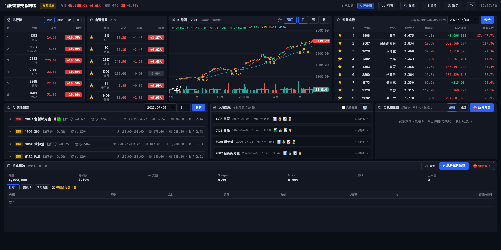

# StockTradingSystem

台股 AI 全自動交易系統——以「持續檢討、學習、優化」為核心的閉環決策系統。

多因子量化選股初篩，交由 LLM 分析師團隊深入分析並經驗證層防幻覺把關，由交易員 Agent 產出交易計畫，再通過確定性的 Guard 風控管線後才進入模擬執行；成果回饋至向量記憶與週反思，注入下一次決策。

架構融合 [CryptoTrade](https://github.com/Xtra-Computing/CryptoTrade)（多 LLM 分析師 + 交易員 Agent + Reflection）與 [LLM_trader](https://github.com/qrak/LLM_trader)（向量記憶、輸出驗證層、Guard 風控）的設計理念；WebUI 交易終端的介面設計與技術棧參考 [shioaji-pro-app](https://github.com/Sinotrade/shioaji-pro-app)。



## 系統架構

```
資料層 ── shioaji 股價(主) + TWSE/TPEx 官方籌碼/除權息/估值 + FinMind(備援)
   ↓        還原價、查詢時清洗、品質檢查、增量回補、背景排程
選股 ──── 多因子量化初篩（動能/籌碼/營收/季線，橫斷面 z-score，無前視偏差）
   ↓
決策 ──── LLM 分析師 ×3（技術/籌碼/基本面）→ 驗證層（引用數字比對實算，防幻覺）
   ↓      → 交易員 Agent（進場區間/停損/目標/R:R）← 向量記憶注入（相似經驗 + 反思規則）
風控 ──── Guard pipeline 九閘（處置股/熔斷/R:R/冷卻/風險部位/單股/產業/現金）
   ↓      確定性規則，LLM 不可逾越；駁回寫入 friction log
執行 ──── PaperBroker 模擬帳本（隔日限價/停損停利/費稅損益）+ 每日主流程 + 內建排程
   ↓
學習 ──── 成果評估器（計畫 vs 後續真實價格）→ ChromaDB 三集合（經驗/規則/被擋）
          → 週反思（LLM 歸納規則/反模式）→ 注入下次決策  ⟲ 閉環
```

## 功能特色

- **React 交易終端**：K 線圖、自選/排行、量化選股、AI 選股報告、策略回測、持倉績效、LLM 活動監控，面板可自由佈局（介面設計參考 [shioaji-pro-app](https://github.com/Sinotrade/shioaji-pro-app)）
- **三源資料層**：shioaji 為主、TWSE/TPEx 官方資料、FinMind 備援，含還原價與資料品質檢查
- **可驗證的 AI 決策**：分析師引用的每個數字都與實際資料比對，攔截幻覺
- **風控優先**：九道確定性風控閘門置於 LLM 之後，任何交易計畫都必須通過
- **無人值守**：後端內建排程器，平日自動增量更新資料、執行每日交易主流程，並以 Telegram 推播每日決策報告
- **閉環學習**：每筆決策的成果被評估、記憶、反思，持續修正後續決策

## 快速開始

```bash
# 安裝（Apple Silicon 請使用 arch -arm64 執行 pip）
python3 -m venv .venv
.venv/bin/pip install -r requirements.txt
cd frontend && npm install && cd ..

# 啟動（FastAPI :8000 + React :5173）
bash scripts/dev.sh
```

開啟 http://localhost:5173，在「⚙️ 設定 → API 金鑰」填入金鑰、於「📦 資料」執行首次回補後即可使用。
完整操作流程見 **[使用手冊 USAGE.md](USAGE.md)**。

### 所需金鑰

| 環境變數 | 用途 |
|---|---|
| `ANTHROPIC_API_KEY` | LLM 分析 / 決策 / 反思 |
| `SJ_API_KEY` / `SJ_SEC_KEY` | 永豐 shioaji：股價主源、排行 |
| `FINMIND_TOKEN` | 指數價格與資料備援 |

金鑰可於 WebUI 設定頁填寫，寫入 `.env`，不進版控。

## 專案結構

```
api/               FastAPI 後端（REST API + 內建排程器）
frontend/          React 19 + Vite + lightweight-charts 交易終端
src/
  data/            資料層：shioaji / TWSE 官方 / FinMind 三源、還原價、品質檢查
  screener/        多因子選股
  agents/          LLM 分析師、驗證層、交易員、決策管線
  risk/            Guard pipeline 風控
  memory/          ChromaDB 向量記憶、成果評估、反思引擎
  broker/          PaperBroker 模擬帳本
  pipeline/        每日交易主流程
  backtest/ env/   回測引擎（台股成本模型）
  report/          績效統計
scripts/           CLI 腳本（backfill / run_daily / run_backtest）
config/            settings.yaml 系統參數（金鑰在 .env）
tests/             測試
```

## 開發

```bash
.venv/bin/python -m pytest tests/ -q                       # 執行測試
.venv/bin/python -m scripts.backfill --auto-wait           # 全市場資料回補
.venv/bin/python -m scripts.run_daily                      # 每日交易主流程
.venv/bin/python -m scripts.run_backtest --strategy screener_risk
```

所有 CLI 功能在 WebUI 皆可操作；CLI 主要供排程與除錯使用。

## 文件

- [USAGE.md](USAGE.md) — 使用手冊：安裝、設定、介面導覽、日常操作、常見問題
- [PLAN.md](PLAN.md) — 系統規劃書：架構設計、技術選型、分階段執行計畫

## 授權

本專案採 [AGPL-3.0](LICENSE) 授權。致謝：[CryptoTrade](https://github.com/Xtra-Computing/CryptoTrade) 與 [LLM_trader](https://github.com/qrak/LLM_trader) 為架構設計之理念參考；[shioaji-pro-app](https://github.com/Sinotrade/shioaji-pro-app) 為交易終端介面設計與技術棧之參考。

## 免責聲明

本專案僅供研究與教育用途，不構成任何投資建議。目前以模擬帳本（paper trading）運行；實盤交易涉及重大財務風險，使用者須自行承擔一切後果。
